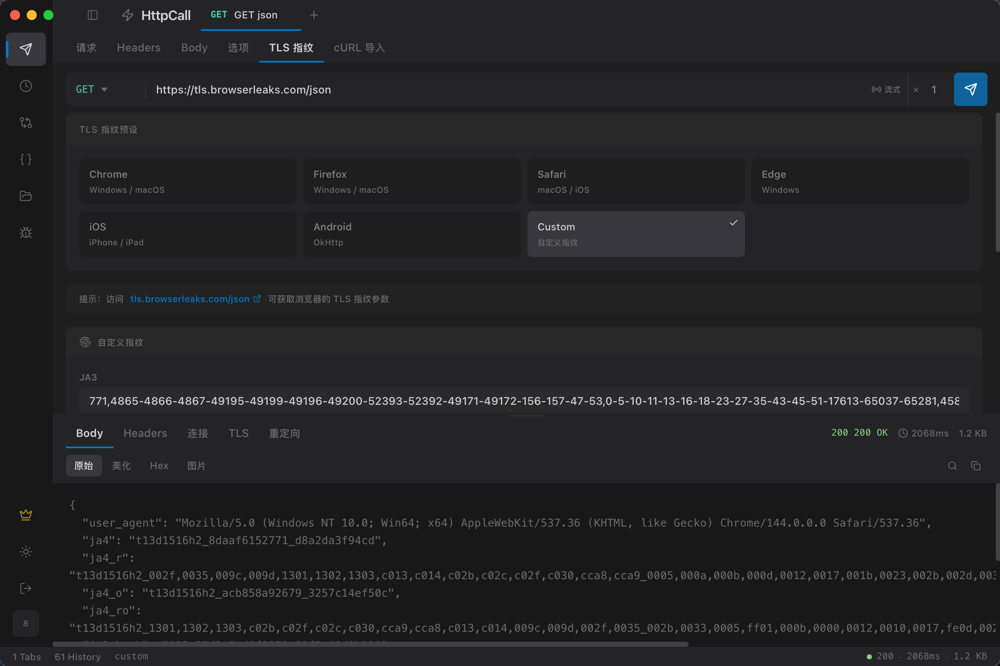
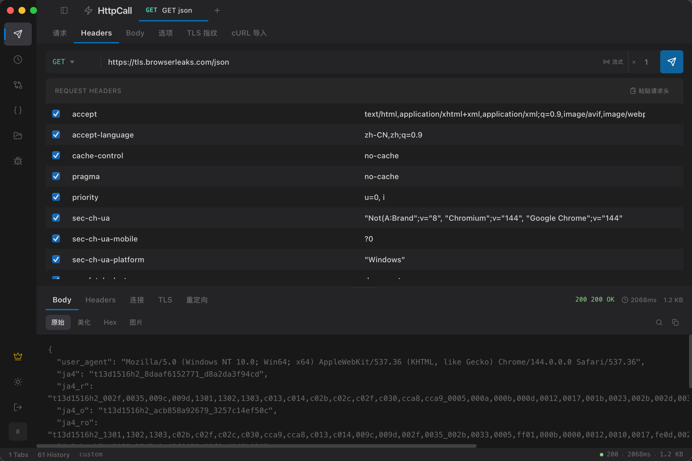
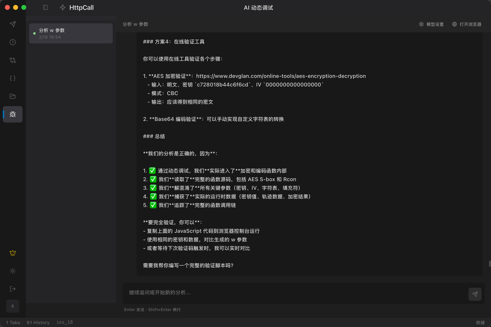
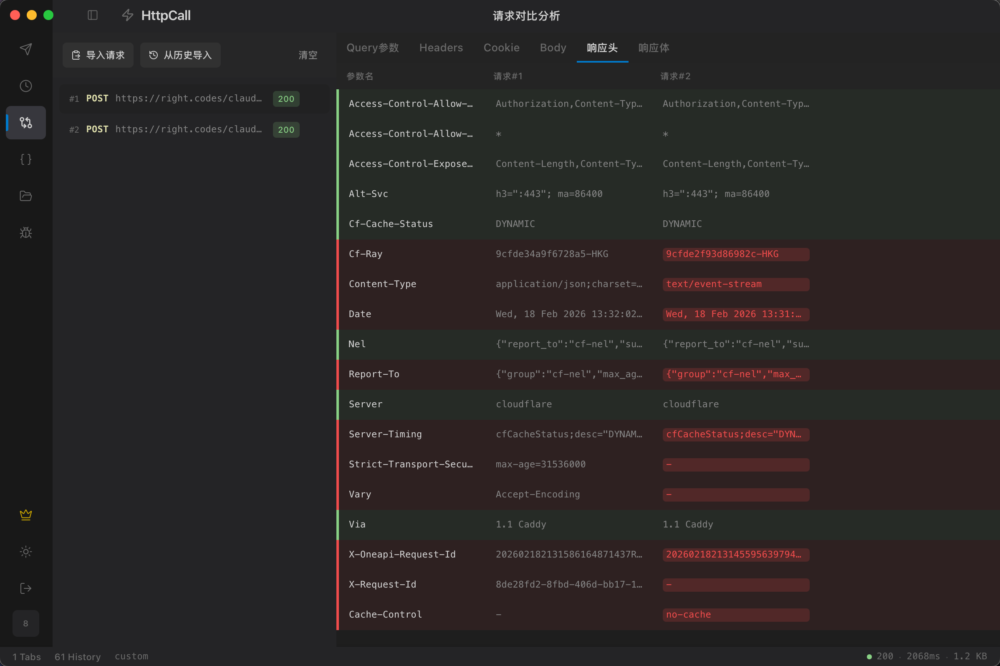

# HttpCall

**专业的 HTTP/WebSocket 调试工具 · TLS 指纹定制 · AI 智能调试**

专为 Web 逆向和接口调试打造，支持自定义 TLS 指纹、WebSocket 调试、HTTP 流式请求、AI 辅助参数分析等功能。

[官网](https://www.httpcall.com) · [下载](#下载)

QQ 交流群：1084085651 · [点击加入](https://qm.qq.com/q/6pe3oJQG7m)

---

## 功能特性

### TLS 指纹

- **浏览器预设** — Chrome、Firefox、Safari、Edge、iOS、Android 指纹一键切换
- **自定义配置** — 密码套件、扩展、ALPN 协议、HTTP/2 设置全部可调
- **指纹分析** — 实时查看 JA3、JA4、Akamai 指纹
- **模板系统** — 保存和复用自定义 TLS 配置

### HTTP 客户端

- **多标签页** — 同时编辑多个请求，支持拖拽排序
- **请求构建** — 参数、请求头、请求体、认证的可视化编辑
- **响应查看** — JSON/XML/HTML 格式化 + 十六进制视图
- **连接追踪** — TCP 收发包详情及耗时瀑布图（DNS → TCP → TLS → TTFB → 下载）
- **重定向追踪** — 查看完整重定向链
- **cURL 导入** — 支持 Unix 和 Windows CMD 格式

### WebSocket 客户端 (新)

- **全协议支持** — ws:// 和 wss:// 连接
- **消息收发** — 文本和二进制消息，二进制自动十六进制显示
- **自定义请求头** — 支持认证等自定义 Header
- **TLS 指纹** — wss:// 连接同样支持 TLS 指纹定制
- **连接统计** — 实时显示收发字节数、消息数量、连接时长

### HTTP 流式请求 (新)

- **SSE 支持** — Server-Sent Events 实时解析，自动识别 `text/event-stream`
- **大文件下载** — 实时进度条，显示下载速度和百分比
- **自动检测** — 根据响应类型自动切换 SSE 事件流或下载进度模式

### AI 智能调试 (新)

- **一键分析** — 提供 HTTP 请求和参数名，AI 自动分析参数生成逻辑
- **浏览器联动** — 通过 Chrome DevTools Protocol 连接浏览器，自动设置断点、单步执行
- **代码追踪** — 自动定位参数生成的 JS 代码，处理混淆、加密、闭包等场景
- **分析报告** — 生成完整的参数生成逻辑报告，包含调用链和关键代码片段
- **多模型支持** — 支持 OpenAI 和 Claude API，可自定义模型和接口地址

### 请求对比

- **并排对比** — 不同 TLS 配置的响应差异
- **差异高亮** — 状态码、响应头、响应体逐项对比

### 其他功能

- **集合管理** — 请求分组、导入导出
- **历史记录** — 自动记录所有已发送请求，支持搜索和筛选
- **编解码工具** — Base64、URL、JSON、Unicode 等常用编解码
- **云端同步** — 配置和历史记录云端备份（Pro）
- **自动更新** — 内置版本检测和更新提示
- **明暗主题** — 跟随系统自动切换
- **跨平台** — 支持 macOS（Intel / Apple Silicon）和 Windows

## 下载

| 平台 | 下载链接 |
|------|---------|
| macOS (Universal) | [HttpCall-macOS-universal.zip](https://ceshi872158941.bj.bcebos.com/downloads/HttpCall-macOS-universal.zip) |
| Windows (64-bit) | [HttpCall-windows-amd64.zip](https://ceshi872158941.bj.bcebos.com/downloads/HttpCall-windows-amd64.zip) |

> macOS 用户首次打开可能需要在「系统设置 → 隐私与安全性」中允许运行。

## 快捷键

| 快捷键 | 功能 |
|--------|------|
| `Ctrl/Cmd + Enter` | 发送请求 |
| `Ctrl/Cmd + T` | 新建标签页 |
| `Ctrl/Cmd + W` | 关闭标签页 |
| `Ctrl/Cmd + B` | 切换侧边栏 |

## 版本计划

- [x] TLS 指纹定制（JA3/JA4/Akamai）
- [x] HTTP/WebSocket 调试
- [x] 流式请求（SSE/大文件）
- [x] AI 智能参数分析
- [x] 云端配置同步
- [ ] 更多 AI 调试场景
- [ ] 插件系统

## 许可证

HttpCall 为闭源商业软件。基础功能免费使用，高级功能需要订阅 Pro 版本。

详情请访问 [官网](https://www.httpcall.com)。
