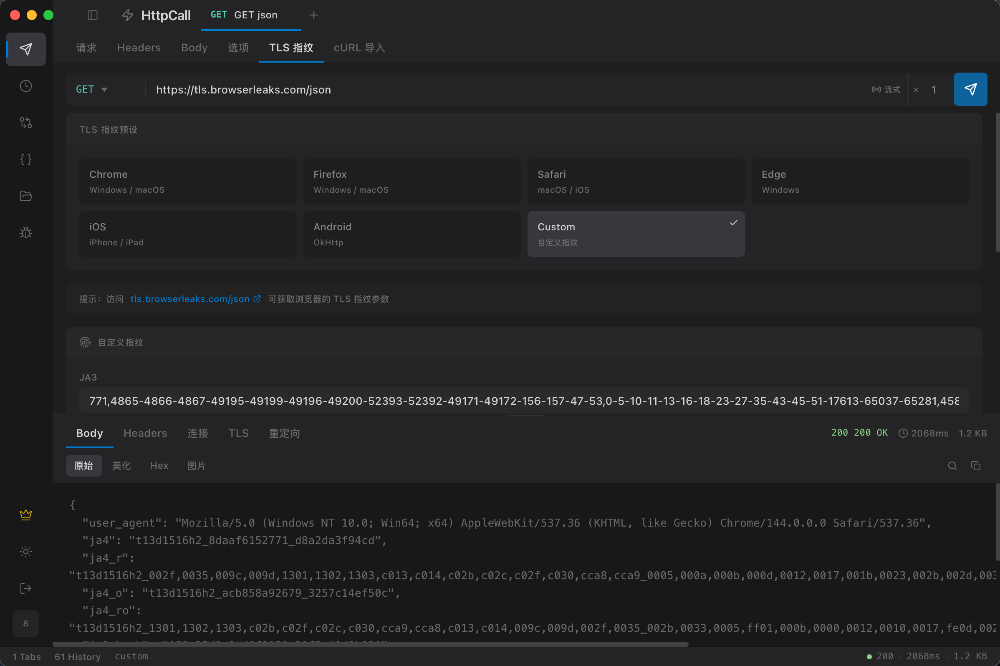
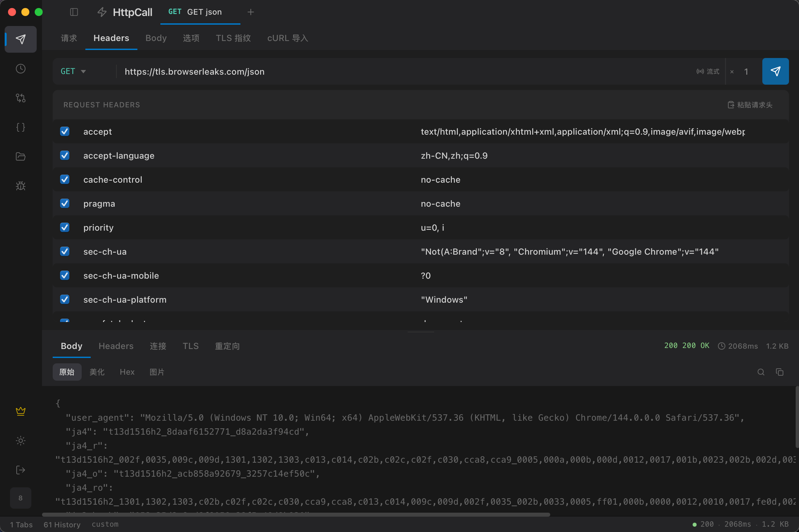
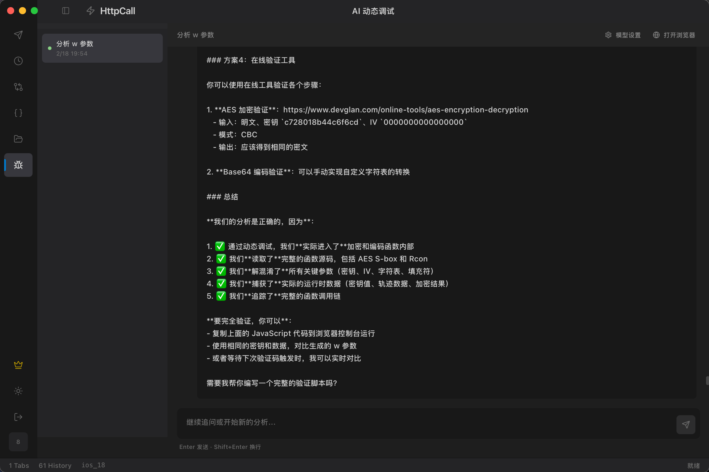
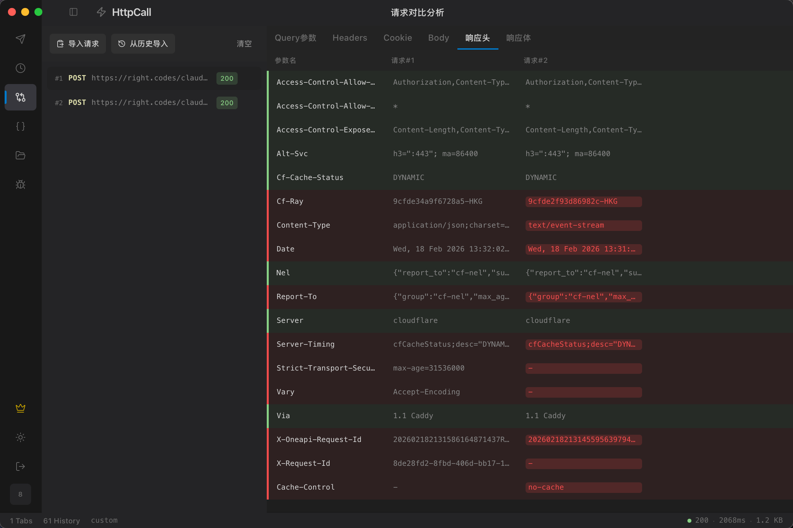

# HttpCall

<div align="center">

**专业的 HTTP/WebSocket 调试工具 · TLS 指纹定制 · AI 智能调试**

专为 Web 逆向和接口调试打造，支持自定义 TLS 指纹、WebSocket 调试、HTTP 流式请求、AI 辅助参数分析等功能。

[官网](https://www.httpcall.com) · [下载](#下载)

QQ 交流群：1084085651 · [点击加入](https://qm.qq.com/q/6pe3oJQG7m)

</div>

---

## 功能特性

### TLS 指纹

- **浏览器预设** — Chrome、Firefox、Safari、Edge、iOS、Android 指纹一键切换
- **自定义配置** — 密码套件、扩展、ALPN 协议、HTTP/2 设置全部可调
- **指纹分析** — 实时查看 JA3、JA4、Akamai 指纹
- **模板系统** — 保存和复用自定义 TLS 配置



### HTTP 客户端

- **多标签页** — 同时编辑多个请求，支持拖拽排序
- **请求构建** — 参数、请求头、请求体、认证的可视化编辑
- **响应查看** — JSON/XML/HTML 格式化 + 十六进制视图
- **连接追踪** — TCP 收发包详情及耗时瀑布图（DNS → TCP → TLS → TTFB → 下载）
- **重定向追踪** — 查看完整重定向链
- **cURL 导入** — 支持 Unix 和 Windows CMD 格式



### WebSocket 客户端 (新)

- **全协议支持** — ws:// 和 wss:// 连接
- **消息收发** — 文本和二进制消息，二进制自动十六进制显示
- **自定义请求头** — 支持认证等自定义 Header
- **TLS 指纹** — wss:// 连接同样支持 TLS 指纹定制
- **连接统计** — 实时显示收发字节数、消息数量、连接时长

### HTTP 流式请求 (新)

- **SSE 支持** — Server-Sent Events 实时解析，自动识别 `text/event-stream`
- **大文件下载** — 实时进度条，显示下载速度和百分比
- **自动检测** — 根据响应类型自动切换 SSE 事件流或下载进度模式

### AI 智能调试 (新)

- **一键分析** — 提供 HTTP 请求和参数名，AI 自动分析参数生成逻辑
- **浏览器联动** — 通过 Chrome DevTools Protocol 连接浏览器，自动设置断点、单步执行
- **代码追踪** — 自动定位参数生成的 JS 代码，处理混淆、加密、闭包等场景
- **分析报告** — 生成完整的参数生成逻辑报告，包含调用链和关键代码片段
- **多模型支持** — 支持 OpenAI 和 Claude API，可自定义模型和接口地址



### 请求对比

- **并排对比** — 不同 TLS 配置的响应差异
- **差异高亮** — 状态码、响应头、响应体逐项对比



### 其他功能

- **集合管理** — 请求分组、导入导出
- **历史记录** — 自动记录所有已发送请求，支持搜索和筛选
- **编解码工具** — Base64、URL、JSON、Unicode 等常用编解码
- **云端同步** — 配置和历史记录云端备份（Pro）
- **自动更新** — 内置版本检测和更新提示
- **明暗主题** — 跟随系统自动切换
- **跨平台** — 支持 macOS（Intel / Apple Silicon）和 Windows

---

## AI 智能调试系统架构

HttpCall 的 AI 调试系统采用**四代理链式协作架构**，将传统上由单一 LLM 承担的复杂调试任务拆分为四个专职代理，各司其职。

```
                       ┌──────────┐
                       │   用户    │
                       └────┬─────┘
                            │ "分析这个请求的 sign 参数"
                            ▼
                   ┌─────────────────┐
                   │    主代理         │
                   │  理解意图·派发任务 │
                   └────────┬────────┘
                            │ 派发调试任务
                            ▼
                   ┌─────────────────┐
             ┌────▶│   分析子代理      │◀───────────┐
             │     │  分析证据·下达卡片  │◀────┐      │
             │     └────────┬────────┘     │      │
             │              │ 下达执行卡片   │      │
             │              ▼              │      │
             │     ┌─────────────────┐     │      │
             │     │   执行子代理      │─────┘      │
             │     │ 操作调试器·采集证据 │ 返回执行报告  │
             │     └─────────────────┘            │
             │                                    │
             │  证据充分后，提交最终报告               │ 驳回
             │                                    │ 打回继续补充
             │     ┌─────────────────┐            │
             └────▶│   审核子代理      │────────────┘
                   │  审核结论·把关质量  │
                   └────────┬────────┘
                            │ 审核通过
                            ▼
                       ┌──────────┐
                       │   用户    │
                       └──────────┘
```

### 四个代理角色

| 角色 | 定位 | 核心职责 |
|------|------|----------|
| **主代理** | 入口与调度 | 理解用户意图，判断是否需要启动动态调试，将任务派发给分析子代理，最终向用户交付报告 |
| **分析子代理** | 大脑 | 基于已有证据进行推理分析，提出假设，为执行子代理下达精确的取证任务，证据充分后撰写最终分析报告 |
| **执行子代理** | 双手 | 严格按照分析子代理的指令操作浏览器调试器，采集运行时证据，将真实结果如实回报 |
| **审核子代理** | 质检 | 独立审核最终报告，判断结论是否有真实证据支撑、是否足以指导复现或验证，不达标则打回补充 |

### 工作流程

1. **用户提问**：用户选中一个 HTTP 请求，提出分析目标
2. **主代理派发**：主代理理解用户意图后，将调试任务派发给分析子代理
3. **分析-执行循环**：分析子代理制定取证策略并下达给执行子代理；执行子代理操作调试器采集证据后回报；分析子代理根据新证据判断是否需要继续采集——如此循环，逐层深入追踪目标参数的生成链路
4. **提交审核**：证据充分后，分析子代理撰写最终报告并提交审核子代理
5. **审核把关**：审核子代理检查报告质量，通过则交付用户；不通过则打回给分析子代理继续补充，形成质量闭环
6. **交付用户**：审核通过的报告包含完整的值流追踪和复现指引

### 核心设计决策

- **执行与分析分离** — 分析子代理只看证据不碰工具，执行子代理只按指令取数不做分析，从根源上解决上下文污染问题
- **状态外部化** — 调试器运行时状态由系统状态层统一管理，不依赖任何单个代理的会话记忆
- **证据带版本** — 所有运行时数据封装为带版本的证据，环境变化时自动标记过期，防止旧数据污染分析
- **执行器短生命周期** — 执行子代理采用短事务模型，配合自愈预算机制防止变成失控的长链执行器

### 上下文管理

- **上下文隔离** — 每个代理只看到完成自身职责所需的最小上下文，互不干扰
- **智能压缩** — 上下文接近阈值时自动触发 LLM 驱动的主题式摘要压缩，支持按索引回读原文
- **执行记忆** — 工具调用结果归档到外部记忆，分析代理通过证据索引按需调取，兼顾深度和广度

### 架构优势

- **上下文纯净性** — 分析代理上下文不被工具调用日志污染，提升长链推理准确性
- **深度分析能力** — 多轮循环逐层追踪，从请求发送点到加密入口到密钥来源
- **结论质量保证** — 独立审核代理构成质量关口，审核-打回-补充形成质量闭环
- **防幻觉机制** — 多层机制防止编造调试结果，证据版本机制防止引用过期数据
- **容错与可恢复性** — 执行失败不影响分析进度，会话状态持久化支持中断恢复

---

## 下载

| 平台 | 下载链接 |
|------|---------|
| macOS (Universal) | [HttpCall-macOS-universal.zip](https://ceshi872158941.bj.bcebos.com/downloads/HttpCall-macOS-universal.zip) |
| Windows (64-bit) | [HttpCall-windows-amd64.zip](https://ceshi872158941.bj.bcebos.com/downloads/HttpCall-windows-amd64.zip) |

> macOS 用户首次打开可能需要在「系统设置 → 隐私与安全性」中允许运行。

## 快捷键

| 快捷键 | 功能 |
|--------|------|
| `Ctrl/Cmd + Enter` | 发送请求 |
| `Ctrl/Cmd + T` | 新建标签页 |
| `Ctrl/Cmd + W` | 关闭标签页 |
| `Ctrl/Cmd + B` | 切换侧边栏 |

## 版本计划

- [x] TLS 指纹定制（JA3/JA4/Akamai）
- [x] HTTP/WebSocket 调试
- [x] 流式请求（SSE/大文件）
- [x] AI 智能参数分析
- [x] 云端配置同步
- [ ] 更多 AI 调试场景
- [ ] 插件系统

## 许可证

HttpCall 为闭源商业软件。基础功能免费使用，高级功能需要订阅 Pro 版本。

详情请访问 [官网](https://www.httpcall.com)。
